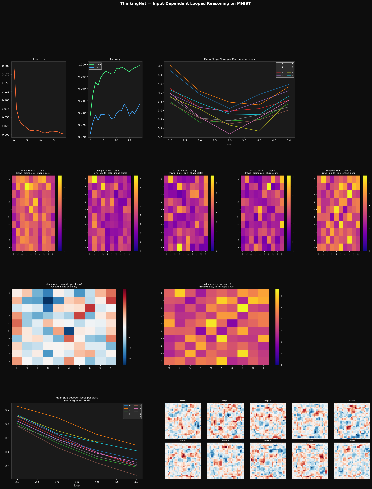

# Input-Dependent Networks & Forced Superposition

An experiment in multiplicative gating, superposition, and how much you can squeeze out of almost no neurons.

## The Architecture

```
mod1 = x @ W1_mod
h    = relu(W1_base(x) * mod1)
out  = W2_base(h)
```

Each hidden neuron computes a **quadratic form** in the input — the base linear projection gated by a separate learned modulator. This makes each neuron degree-2 in x, far more expressive than a standard relu neuron.

The key property: the effective weight matrix changes per input. The network computes different linear transformations depending on what it sees.

## The Superposition Discovery

Standard networks under capacity pressure kill neurons — they route via death. With enough hidden units, the modulator simply learns to zero out irrelevant neurons for each input class, leaving a sparse skeleton.

**256 hidden (with skip):** 231/256 neurons dead. Network solved MNIST with ~25 neurons.

The fix: make the network too small to afford death.

| Hidden | Skip | Train | Test | Dead | Polysemanticity |
|--------|------|-------|------|------|-----------------|
| 256 | yes | 99.6% | 97.9% | 231/256 | 0 high-poly |
| 16 | yes | 98.4% | 96.6% | 0/16 | 2 high-poly |
| 8 | yes | 97.1% | 95.5% | 0/8 | 5/8 high-poly |
| 4 | yes | 95.8% | 94.5% | 0/4 | 2/3 high-poly |
| 2 | yes | 94.7% | 93.5% | 0/2 | 1/1 high-poly |
| 1 | yes | 93.9% | 93.4% | 0/1 | 1/1 high-poly |
| 1 | no | 36.3% | 36.7% | 0/1 | low-poly |
| 3 | no | 83.4% | 83.3% | 0/3 | 2 high-poly |

**The 1% gap between 4 and 8 neurons** (94.5% vs 95.5%) shows the network finds a near-optimal encoding once it has enough dimensions to separate 10 classes — extra neurons buy robustness, not discrimination.

## Emergent Codebooks

Under extreme bottleneck, the modulator heatmap (mean modulator per class × neuron) reveals a learned discrete code:

- **8 neurons:** clean binary-ish sign pattern per digit, resembling a Gray code. Similar digits (3/8, 1/7) get similar codewords.
- **4 neurons:** near-perfect codebook, each digit assigned a unique activation pattern across 4 neurons.
- **2 neurons:** smooth 1D gradient — one neuron as bias, one as a continuous "digit spectrum" ordinal embedding.
- **1 neuron (no skip):** collapses to low-poly, only 2-3 distinct activation levels. Mathematically impossible to do better with a linear 1→10 readout.

This is **learned error-correcting codes emerging from pure classification pressure** with no explicit codebook loss.

## The Skip Connection Reveal

The original 1-neuron experiment hit 93.4% because `W2_mod` (784×10) was doing the actual classification work, with the single hidden neuron acting as a learned confidence/attention gate. Removing the skip:

```
# with skip:    out = W2_base(h) * W2_mod(x)   → 93.4%
# without skip: out = W2_base(h)                → 36.7%
```

36.7% is the honest 1-neuron result. It respects information theory (log2(10) ≈ 3.32 bits needed, one scalar can't carry it through a linear readout).

## Why Optimization is Easy

The multiplicative gate is a sparsity machine — `W1_mod(x)` going negative kills the neuron via relu. But under capacity pressure, it *can't* kill neurons without losing accuracy, so it's forced to keep all neurons alive and superpose instead.

Hypothesis: input-dependent weights reduce inter-input gradient interference. Each input class can use slightly different "virtual" weights without corrupting the representation for other classes. The loss landscape has wider, more compatible attractors.

## Visualization

Each run produces `mnist_superposition.png` with:
- Training curves
- Classes-per-neuron histogram (polysemanticity)
- Mean modulator per class (the codebook)
- Mean activation per class
- W1_base receptive fields for top polysemantic neurons

### 16 hidden (with skip) — routing by death


### 8 hidden (with skip) — superposition kicks in


### 4 hidden (with skip) — near-optimal codebook


### 2 hidden (with skip) — 1D ordinal embedding


### 1 hidden (with skip) — gated linear classifier


### 1 hidden (no skip) — honest 1-neuron


### 3 hidden (no skip) — 2-bit coding


## ThinkingNet — Looped Reasoning

A different architecture: instead of one forward pass, the same network loops T times, reinjecting the input at every step. Hidden state = 10 "thought shapes" that get iteratively refined.

```
h = zeros(B, n_shapes * shape_dim)
for _ in range(T):
    mod   = W_inp_mod(x)          # input steers the update
    h     = relu(W_state(h) * mod) # state evolves under input control
    h     = LayerNorm(h)
out = head(h)
```

x and h are **never concatenated** — x modulates how h transitions, not what h is. Clean separation of problem and thought.

### 320-dim hidden (10 shapes × 32) — 710k params
- **100% train / 98.4% test**, 0/320 dead
- Smooth convergence: shape norms follow a U-shape across loops — compress at loop 3, expand for readout. Emergent information bottleneck.
- Monotone Δh decrease: genuine fixed-point convergence, not thrashing.



### 10-dim hidden (10 shapes × 1) — 8k params
- **95.2% train / 93.6% test**, 0/10 dead
- Chaotic loop dynamics — norms cross and bounce, no clean convergence. Running a nonlinear dynamical system on a 10-simplex with multiplicative gating produces chaotic attractors rather than fixed points.
- Still lands at 93.6% despite the chaos. W_inp_mod learned good visual features; W_state (10×10) is the unstable part.
- 93.6% accuracy from **8,050 total parameters**.


### Why input-dependent weights are natural for RNNs

Standard RNNs apply the same W_hh every step — fixed eigenspectrum, vanishing/exploding gradients. Here the effective recurrent matrix is `W_state * W_inp_mod(x)` — different every step, steered by the input. No fixed eigenvalue regime to fall into. Gradient paths through time see a different Jacobian at each step, acting like a learned preconditioner for the recurrent gradient flow.

## Files

- `1.py` — XOR with input-dependent weights, numpy finite differences
- `2.py` — MNIST static experiments, PyTorch
- `3.py` — ThinkingNet, looped reasoning, PyTorch

## Key Takeaways

1. **Capacity pressure forces superposition.** You can't engineer it directly in standard nets — you can only hope. Multiplicative gating + bottleneck = guaranteed superposition.
2. **The emergent code is structured.** Gradient descent independently discovers something like Gray codes / error-correcting codes with no supervision on code structure.
3. **Quadratic neurons are worth ~2x linear neurons** in effective expressiveness per slot.
4. **Dead neurons are a routing strategy, not a failure mode.** Given slack, the network prefers death over sharing. Remove the slack.
5. **Loops multiply effective compute per parameter.** ThinkingNet with 8k params matches static nets with 100x more parameters by reusing the same weights 5 times.
6. **Chaotic vs convergent thinking.** Large hidden state → smooth fixed-point convergence. Tiny hidden state → chaotic search that still finds the answer. The dynamical regime depends on hidden dim.
